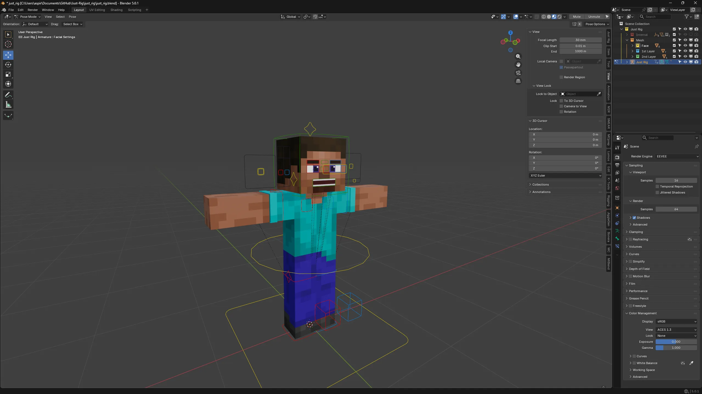
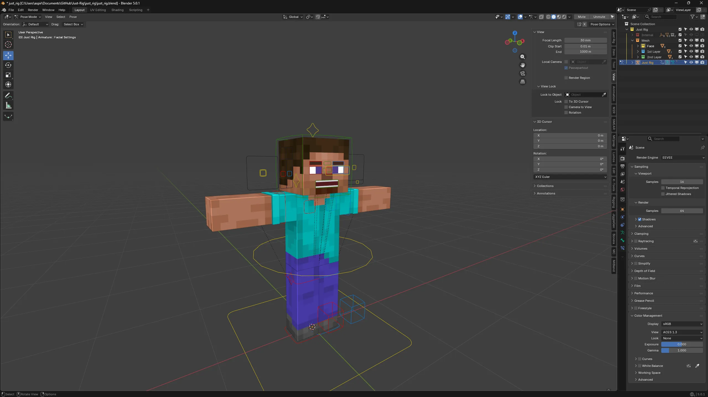
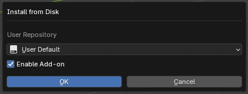
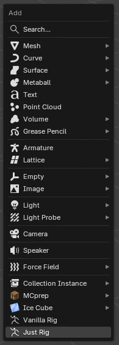

# Just Rig ⚒️

**Just Rig** — это просто риг персонажа Minecraft для Blender 4.2+. Я старался сделать этот риг достаточно простым для модификации, настройки и использования.

> [!WARNING]
> На данный момент риг находится в стадии активного бета тестирования. **Бета-тест продлится до Нового года.**  
> Пожалуйста, сообщайте о любых найденных ошибках.

## 📸 Скриншоты
### Shading Mode

### Solid Mode

## 🚀 Быстрый старт

### Требования
* **Blender: 4.2+**

### Как установить риг и добавить его в сцену
1. [Скачайте последний релиз Just Rig](https://github.com/Aspirata/Just-Rig/releases/latest)
2. Перенесите just_rig.zip на окно блендера и установите расширение  

3. Нажмите **Shift + A** и выбирите **Just Rig**  

## 📅 Запланированные изменения к релизу
- ✅ Добавить Alex Arms
- 🚧 Добавить язык
- 🚧 Создать статичный сайт
- ❌ Исправить "плавающий" правый зрачок

## 💬 Обратная связь

Если вы нашли баг или у вас есть идеи по улучшению **Just Rig**, я буду рад их услышать!
* **Мой Discord Сервер: [Aspirata's Cove](https://discord.gg/gpfgbkdJ97)** 
* **Мой Ник в Discord: aspirata**

## 📄 Лицензия

Этот проект распространяется по лицензии **[MIT](../LICENSE)**.  
Вы можете свободно использовать риг в своих анимациях, а также модифицировать с указанием меня как автора рига:
* **Discord:** `aspirata`
* **YouTube:** [@Aspirata1421](https://www.youtube.com/@Aspirata1421)
* **X (Twitter):** [@Aspirata181256](https://x.com/Aspirata181256)

P.S Можете выбрать любую соц. сеть, не обязательно указывать все
